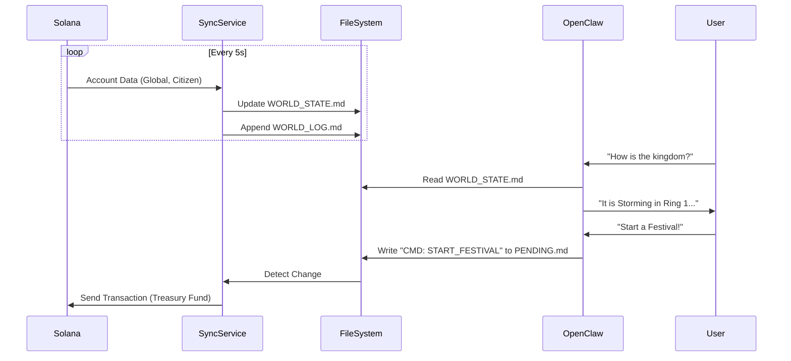

# IMPL: The Sync Bridge (OpenClaw <-> Solana)

## The Problem
Solana is valid, real-time state. OpenClaw is an AI agent that scans files. Use the **Bridge Pattern** to sync them.

## The Architecture
We build a lightweight TypeScript service (`packages/agent-sync`) that sits between the Chain and the Agent.

### 1. The Observer (Chain -> File)
**Role:** "The Scribe"
- **Action:** Polls `ElexaWorld` program accounts every block (or 5s).
- **Output:**
    1.  **Snapshot:** Overwrites `workspace/projects/elexa-live/memories/WORLD_STATE.md` with the current truth (Time, Weather, Treasury Balance, Top 5 Events).
    2.  **History:** Appends to `workspace/projects/elexa-live/memories/WORLD_LOG.md` for permanent history (e.g., "Block 281: Citizen #402 Born").

### 2. The Agent (File -> Thought)
**Role:** "The Game Master"
- **Action:** OpenClaw reads `WORLD_STATE.md` before every response.
- **Context:** Knows exactly what the weather is and how rich the treasury is.

### 3. The Dispatcher (Thought -> Chain)
**Role:** "The Hand"
- **Action:** When Elexa decides to act (e.g., "Start Festival"), she writes a command block to `workspace/projects/elexa-live/actions/PENDING.md`.
- **Execution:** The Sync Service watches this file, parses the command, signs the transaction (with Admin/Council Key), and executes it on-chain.

## Data Flow

## Implementation Plan
1.  **Scaffold**: `packages/agent-sync` (TypeScript + Anchor Client).
2.  **Watcher**: Script to fetch `GlobalWorld` and dump to Markdown.
3.  **Logger**: Script to append events.
4.  **Run**: Keep this running in the background (like the Gateway).
